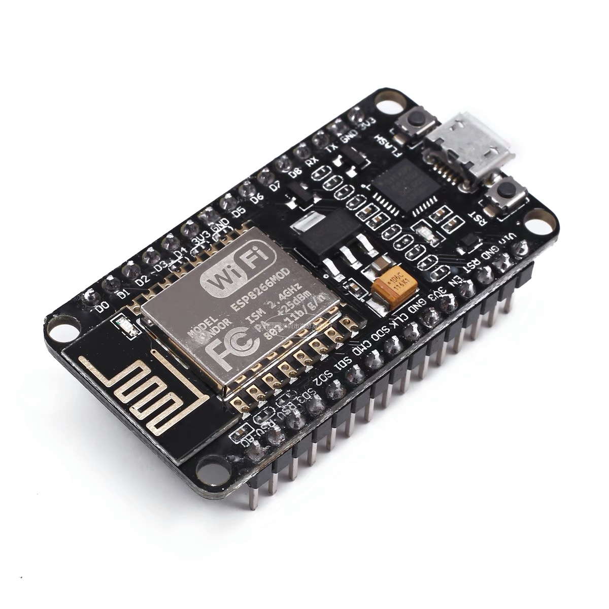
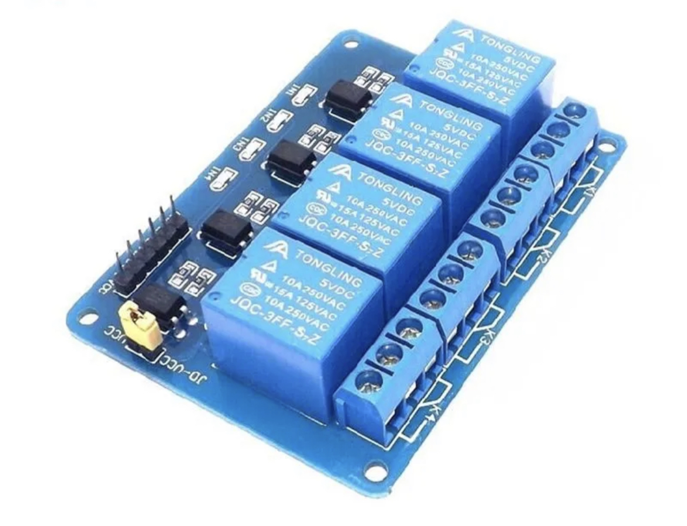
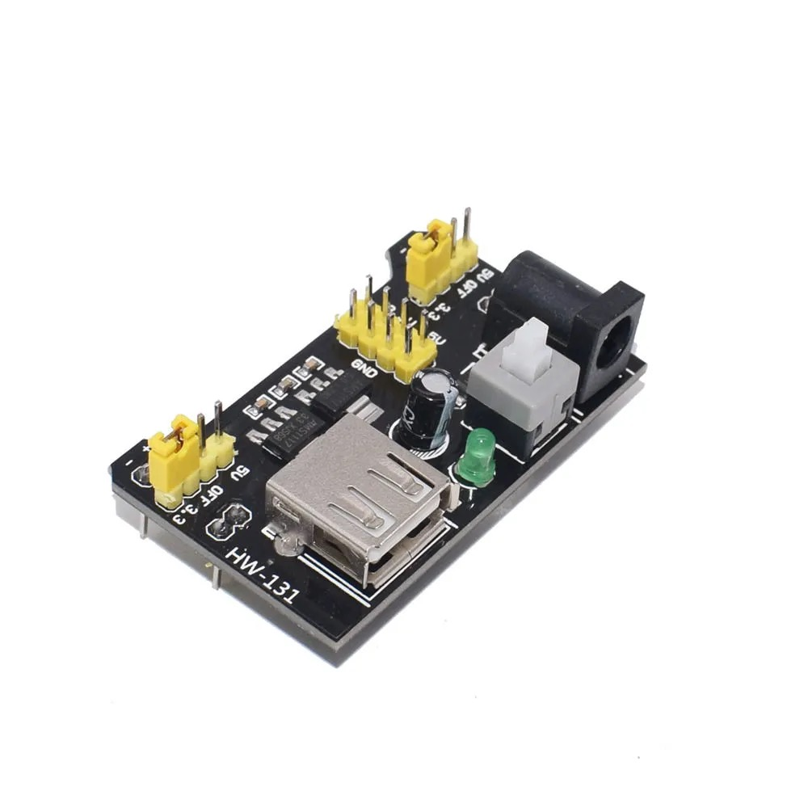

# ESP8266 Homekit 4Relays

## Intro
  - HomeKit with ESP8266-CH2102 for 4 relay-based Home Automation. It's to ontrol home appliances using IOS ecosystem's Apple HomeKit.
  - This single project doesn't include a gateway to support remote control.

## HardWare

### Component

- ESP8266 CH2102

?raw=true

- 4 Relays Module

- Power Supply 5/3.3V

- Jumping Wires

### How to wire

#### ESP8266 & 4Relays :

D1 - INS1

D2 - INS2

D3 - INS3

D4 - INS4

3.3V - Relay VCC

#### 4Relays & Power Supply :

JD-VCC - 5V Power Supply

Relay GND - Power Supply GND

#### ESP8266 & Power Supply :

VIN - 3.3V Power Supply

GND - GND Power Supply

## SoftWare

1. Ensure that your PC has installed ESP8266 CH2102 drivers.
2. Connect ESP8266 with your PC through MicroUSB line.
3. Flash the program into ESP8266.
   - Update line#17~18 in `./wifi_info.h` with your WIFI config.
4. Open Homekit, Find and bind with the switches.
   - Enter the homekit serial number: 20010221 
5. Unplug the MicroUSB line, then assemble all the components together, as well as the electric equipments you want to control.
6. Get power supply, then it works.

## Reference
- https://opensourcelibs.com/libs/homekit
